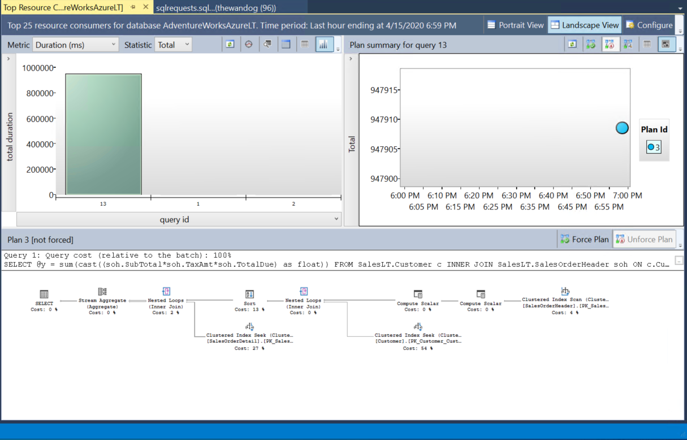
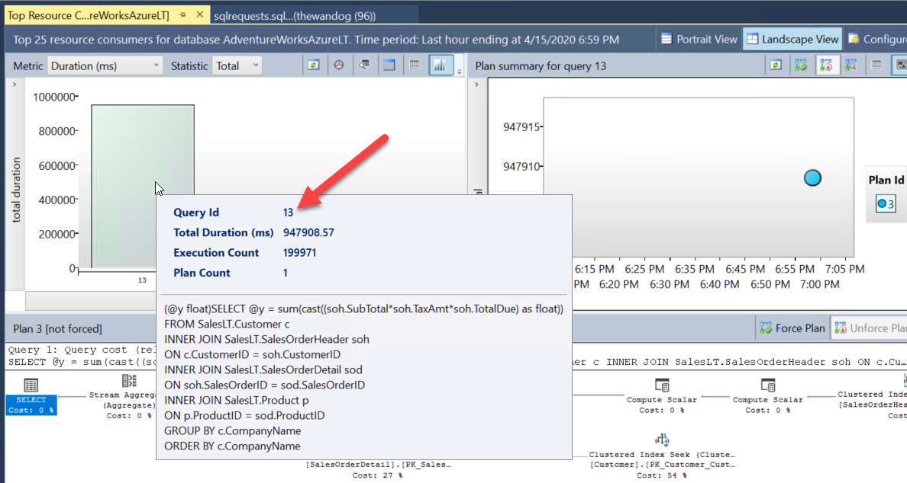
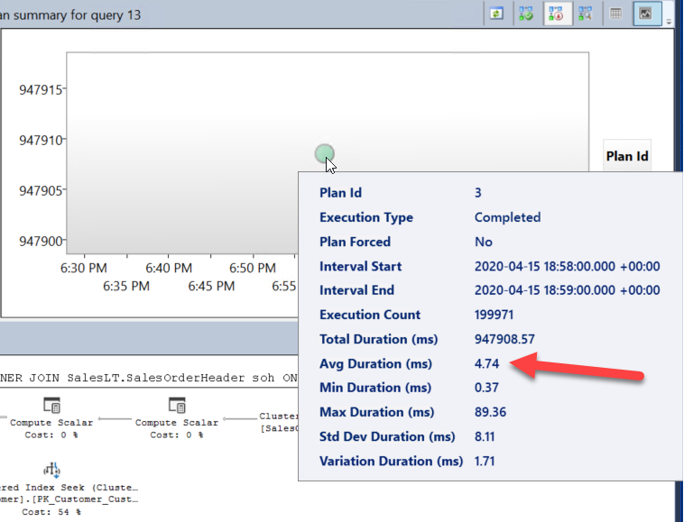
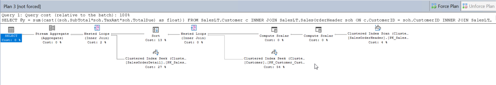
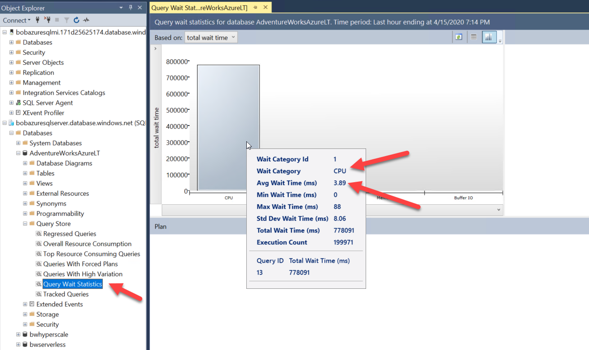
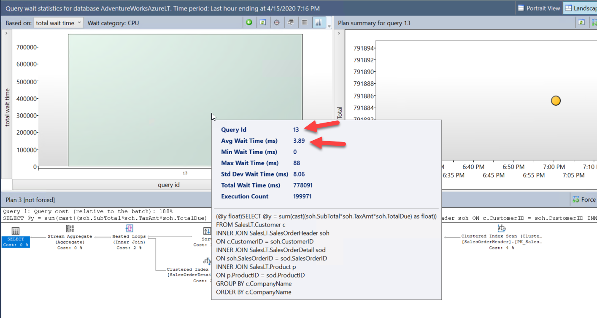
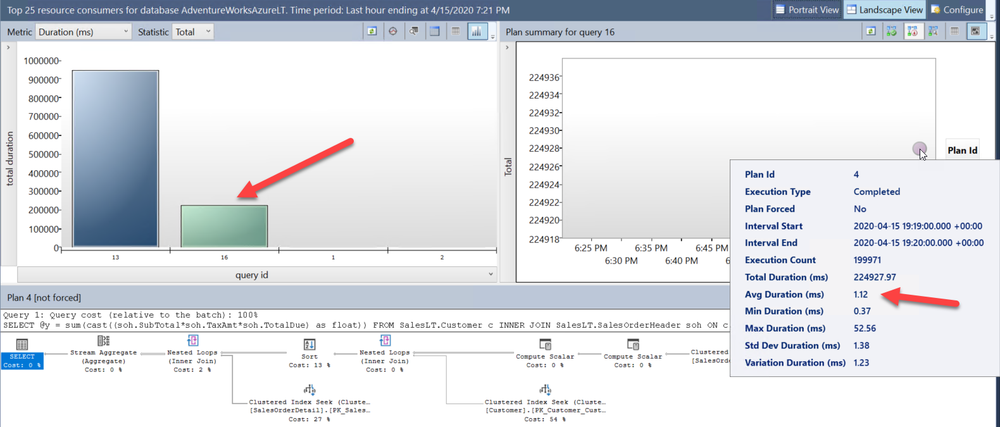
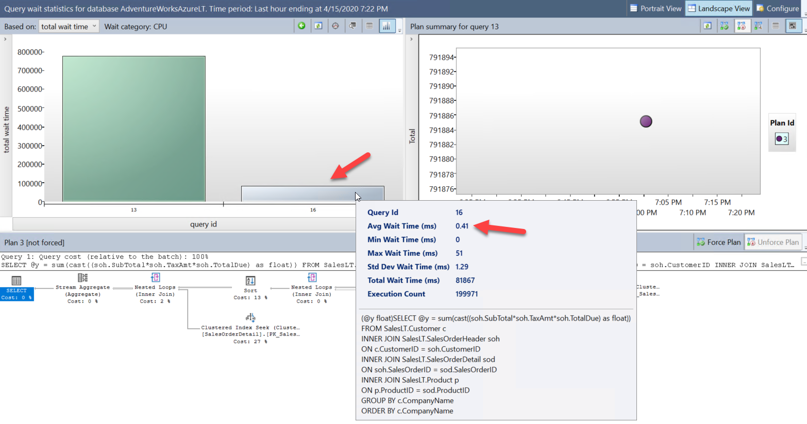

# Module 4 - Performance

#### <i>The Azure SQL Workshop</i>

<p style="border-bottom: 1px solid lightgrey;"></p>

 <h2>Overview</h2>

> **IMPORTANT:** You must complete the [prerequisites](../azuresqlworkshop/00-Prerequisites.md) before completing activities in this module. You can also choose to audit the materials if you cannot complete the prerequisites. If you were provided an environment to use for the workshop, then you **do not need** to complete the prerequisites.

You've been responsible for getting your SQL fast, keeping it fast, and making it fast again when something is wrong. In this module, we'll show you how to leverage your existing performance skills, processes, and tools and apply them to Azure SQL, including taking advantage of the intelligence in Azure to keep your database tuned.

In each module you'll get more references, which you should follow up on to learn more. Also watch for links within the text - click on each one to explore that topic.

>**NOTE:** This module does not configure specific performance topics for **SQL Server in Azure Virtual Machine**. SQL Server in Azure Virtual Machine has all the capabilities of SQL Server you have deployed on-prem. There are some unique aspects to configuring performance for SQL Server in Azure Virtual Machine include Virtual Machine sizing and storage. These topics are covered in Module 1 of this workshop.

In this module, you'll cover these topics:

[4.1](#4.1): Azure SQL **performance capabilities and tasks**<br>
[4.2](#4.2): **Configuring and Maintaining for Performance**<br>
[4.3](#4.3): **Monitoring and troubleshooting performance** in Azure SQL<br>
&nbsp;&nbsp;&nbsp;&nbsp;&nbsp;&nbsp;[Activity 1](#1): How to monitor performance in Azure SQL Database  
[4.4](#4.4): **Accelerating and Tuning Performance** in Azure SQL<br>
&nbsp;&nbsp;&nbsp;&nbsp;&nbsp;&nbsp;[Activity 2](#2): Scaling your workload performance in Azure SQL Database<br>
&nbsp;&nbsp;&nbsp;&nbsp;&nbsp;&nbsp;[Activity 3](#3): Optimizing application performance for Azure SQL Database.<br>
[4.5](#4.5): **Intelligent Performance** in Azure SQL<br>
&nbsp;&nbsp;&nbsp;&nbsp;&nbsp;&nbsp;[Activity 4 (BONUS)](#4): Using Automatic Tuning in Azure SQL Database

<p style="border-bottom: 1px solid lightgrey;"></p>

<h2><a name="4.1">4.1  Azure SQL performance capabilities</h2></a>

Let's start by looking at some of the performance capabilities of Azure SQL as compared to SQL Server.

Since Azure SQL Database and Managed Instance are based on the SQL Server database engine, most of the capabilities that come with SQL Server are also available with Azure SQL. There are a few capabilities that have an impact on the performance of your databases that you should consider when deploying and configuring Azure SQL including maximum capacities, indexes, In-Memory OLTP, partitions, SQL Server 2019 enhancements, and Intelligent Performance capabilities.

### Memory, CPU, and I/O capacities

Choosing the right deployment and service tier for Azure SQL Database or Managed Instance can be important for performance. In second Module you learned about the various deployment options for Azure SQL. Consider these important maximum capacities as part of your deployment:

- Azure SQL Database can support up to 128 vCores, 4TB Memory, and a 4TB Database size.
- The Hyperscale deployment option supports up to 100TB databases.
- Azure SQL Managed Instance can support up to 80 vCores, 400Gb Memory, and a 8TB Database size.
- The # of vCores and service tier also affects other resource capacities (Ex. maximum transaction log rates, IOPS, I/O latency, memory, ...).
- Windows Job Objects are used to support certain resource limits such as memory. Use **sys.dm_os_job_object** to find true capacities for your deployment.

Here are resources for you to review these capacities:

[Azure SQL Database Resource Limits](https://docs.microsoft.com/en-us/azure/sql-database/sql-database-vcore-resource-limits-single-databases)

[Azure SQL Database Managed Instance Resource Limits](https://docs.microsoft.com/en-us/azure/sql-database/sql-database-managed-instance-resource-limits)

### Indexes

Indexes are often critical to query performance for SQL Server and that is not different for Azure SQL. Here are important points to consider about indexes and Azure SQL:

- All index types, clustered and non-clustered, are supported across Azure SQL.
- Online and resumable indexes are fully supported. Online and resumable indexes can be critical for maximum availability.
- Columnstore indexes are available in almost all service tiers. Check the documentation for any exceptions.

### In-Memory OLTP

In-Memory OLTP is a capability for transaction latency sensitive applications, such as applications that involve a high number of concurrent users modifying data. Here are important points related to In-Memory OLTP and Azure SQL:

- Memory optimized tables are only available in Business Critical Tiers.
- The memory optimized FILEGROUP is pre-created in Azure SQL Database and Managed Instance when a database is created (even for General Purpose tiers).
- The amount of memory for memory optimized tables is a percentage of the vCore dependent memory limit.

### Partitions

Partitions are often used with SQL Server for tables with a large number of rows to improve performance by sub-dividing data by a column in the table. Consider these points for partitions and Azure SQL:

- Partitions are supported for Azure SQL Database and Managed Instance.
- You can only use filegroups with partitions with Azure SQL Managed Instance.

### SQL Server 2019 performance enhancements

Many of the new enhancements for performance in SQL Server 2019 such as Intelligent Query Processing are available in Azure SQL. However, not all specific improvements are yet in Azure SQL. For example, Tempdb Metadata Optimization is still planned for Azure SQL but not available yet.

### Intelligent performance

Intelligent performance covers capabilities in Azure SQL that include intelligent query processing, automatic plan correction, and automatic tuning (including indexes). You will learn more about these features later in this module.

<p style="border-bottom: 1px solid lightgrey;"></p>

<h2><a name="4.2">4.2  Configuring and Maintaining for Performance</h2></a>

Understanding the capabilities of Azure SQL is important for delivering consistent performance. It is also important to understand what options and restrictions you have to configure Azure SQL Managed Instance and Databases that can impact performance. This includes topics of the tempdb database, configuring databases, configuring files and filegroups, configuring max degree of parallelism, using Resource Governor, and maintaining indexes and statistics.

### Configuring Tempdb

Tempdb is an important shared resource used by applications. Ensuring the right configuration of tempdb can affect your ability to deliver consistent performance. Tempdb is used the same with Azure SQL like SQL Server but your ability to configure tempdb is different including placement of files, the number and size of files, and tempdb configuration options.

Tempdb files are always automatically stored on local SSD drives so I/O performance shouldn't be an issue.

SQL Server professionals often use more than one database file to partition allocations for tempdb tables.  For Azure SQL Database, the number of files are scaled with the number of vCores (Ex. 2 vCores=4 files,…) with a max of 16. The number of files is not configurable through T-SQL against tempdb but by changing the deployment option. The maximum size of tempdb is scaled per number of vCores. You get 12 files with Azure SQL Managed Instance independent of vCores and you cannot change this number. We are looking in the future to allow configuration of the number of files for Azure SQL Managed Instance.

Database options MIXED_PAGE_ALLOCATION is set to OFF and AUTOGROW_ALL_FILES is set to ON. This cannot be configured but they are the recommended defaults as with SQL Server.

Currently, the Tempdb Metadata Optimization feature in SQL Server 2019, which can alleviate heavy latch contention, is not available in Azure SQL but is planned for the future.

### Database Configuration

Database configuration is most commonly done with the T-SQL ALTER DATABASE and ALTER DATABASE SCOPED CONFIGURATION statements. Many of the configuration options for performance are available for Azure SQL. Consult the [ALTER DATABASE](https://docs.microsoft.com/en-us/sql/t-sql/statements/alter-database-transact-sql) and [ALTER DATABASE SCOPED CONFIGURATION](https://docs.microsoft.com/en-us/sql/t-sql/statements/alter-database-scoped-configuration-transact-sq) T-SQL reference for the differences between SQL Server, Azure SQL Database, and Azure SQL Managed Instance.

For performance, one option that is not available to change is the recovery model of the database. The default is full recovery and cannot be modified. This ensures your database can meet Azure service level agreements (SLAs). Therefore, minimal logging for bulk operations is not supported. Minimal logging for bulk operations is supported for tempdb.

**Configuring Files and File Groups**

SQL Server professionals often use files and filegroups to improve I/O performance through physical file placement. Azure SQL does not allow users to place files on specific disk systems. However, Azure SQL has resource commitments for I/O performance with regards to rates, IOPS, and latencies so abstracting the user from physical file placement can be a benefit.

Azure SQL Database may have one or more files depending on the Data Max Size (Hyperscale typically has multiple files) and the maximum size is configured through Azure interfaces. There is no functionality to create additional files.

Azure SQL Managed Instance supports adding database files and configuring sizes but not physical placement of files. The number of files and file sizes for Azure SQL Managed Instance can be used to improve I/O performance. Read more [here](https://techcommunity.microsoft.com/t5/datacat/storage-performance-best-practices-and-considerations-for-azure/ba-p/305525). 

In addition, user defined filegroups are supported for Azure SQL Managed Instance for manageability purposes.

**Configuring MAXDOP**

Max degree of parallelism (MAXDOP), which can affect the performance of individual queries, works exactly the same in the engine for Azure SQL as SQL Server. The ability to configure MAXDOP may be important to delivering consistent performance in Azure SQL. You can configure MAXDOP in Azure SQL similar to SQL Server using the following techniques:

- ALTER DATABASE SCOPED CONFIGURATION to configure MAXDOP is supported for Azure SQL
- sp_configure for 'max degree of parallelism' is supported for Managed Instance.
- MAXDOP query hints are fully supported
- Configuring MAXDOP with Resource Governor is supported for Managed Instance.

### Resource Governor

Resource Governor is a feature in SQL Server that can be used to control resource usage for workloads through I/O, CPU, and memory. While Resource Governor is used behind the scenes for Azure SQL Database, Resource Governor is only supported for Azure SQL Managed Instance for user defined workload groups and pools.

### Maintaining indexes

Index creation and maintenance for Azure SQL is exactly the same as SQL Server. For example, creating, rebuilding and reorganization of indexes is fully supported as with SQL Server. This includes online and resumable indexes..

### Maintaining statistics

Statistics are the same for Azure SQL as with SQL Server. Automatic statistics options for databases are available for Azure SQL just like SQL Server.

Now that you have learned some of the configuration and maintenance options for performance for Azure SQL, complete the following knowledge check before proceeding to the next unit.

<p style="border-bottom: 1px solid lightgrey;"></p>

<h2><a name="4.3">4.3 Monitoring and troubleshooting performance in Azure SQL</h2></a>

Monitoring and troubleshooting is a key element to deliver consistent performance. Azure SQL has the same tools and features as SQL Server to monitor and troubleshoot performance plus additional capabilities. This includes features like Dynamic Management Views (DMV), Extended Events, and Azure Monitor. It is also important to learn how to use these tools and capabilities across various performance scenarios for Azure SQL like high CPU or waiting on a resource.

An activity is included in this section to show you how to use familiar and new tools to monitor performance with azure SQL.

## Monitoring and Troubleshooting Performance Tools

Azure SQL provides monitoring and troubleshooting capabilities in the Azure ecosystem as well familiar tools that come with SQL Server. These include the following:

### Azure Monitor

Azure Monitor is part of the Azure ecosystem and Azure SQL is integrated to support Azure Metrics, Alerts, and Logs. Azure Monitor data can be visualized in the Azure Portal or accessed by applications through Azure Event Hub or APIs. An example of why Azure Monitor is important is accessing resource usage metrics for Azure SQL outside of SQL Server tools much like Windows Performance Monitor.

### Dynamic Management Views (DMV)

Azure SQL provides the same DMV infrastructure as with SQL Server with a few differences. DMVs are a crucial aspect to performance monitoring since you can view key SQL Server performance data using standard T-SQL queries. Information such as active queries, resource usage, query plans, and resource wait types. Learn more details about DMVs with Azure SQL later in this module.

### Extended Events

Azure SQL provides the same Extended Events infrastructure as with SQL Server with a few differences. Extended Events is a method to trace key events of execution within SQL Server that powers Azure SQL. For performance, extended events allow you to trace the execution of individual queries. Learn more details about Extended Events with Azure SQL later in this module.

### Lightweight Query Profiling

Lightweight Query Profiling is a capability to examine the query plan and running state of an active query. This is a key feature to debug query performance for statements as they are running. This capability cuts down the time for you to solve performance problems vs using tools like Extended Events to trace query performance. Lightweight Query Profiling is accessed through DMVs and is on by default for Azure SQL just like SQL Server 2019.

### Query Plan Debugging

In some situations, you may need additional details about query performance for an individual T-SQL statement. T-SQL SET statements such as SHOWPLAN and STATISTICS can provide these details and are fully supported for Azure SQL as they are for SQL Server.

### Query Store

Query Store is a historical record of performance execution for queries stored in the user database. Query Store is on by default for Azure SQL and is used to provide capabilities such as Automatic Plan Correction and Automatic Tuning. SQL Server Management Studio (SSMS) reports for Query Store are available for Azure SQL. These reports can be used to find top resource consuming queries including query plan differences and top wait types to look at resource wait scenarios.

### Performance Visualizations

For Azure SQL Database, we have integrated Query Store performance information into the Azure Portal through visualizations. This way you can see some of the same information for Query Store as you would with a client tool like SSMS by just using the Azure Portal options called **Performance Overview** and **Query Performance Insight**.

## Dynamic Management Views (DMV) details

Dynamic Management Views (DMV) have been a driving force to monitor and troubleshoot performance for many years with SQL Server. Common DMVs for SQL Server are available with Azure SQL and some additional ones specific to Azure.

### Azure SQL Managed Instance

All DMVs for SQL Server are available for Managed Instance. Key DMVs like **sys.dm_exec_requests** and **sys.dm_os_wait_stats** are commonly used to examine query performance.

One DMV is specific to Azure called **sys.server_resource_stats** and shows historical resource usage for the Managed Instance. This is an important DMV to see resource usage since you do not have direct access to OS tools like Performance Monitor.

### Azure SQL Database

Most of the common DMVs you need for performance including **sys.dm_exec_requests** and **sys.dm_os_wait_stats** are available. It is important to know that these DMVs only provide information specific to the database and not across all databases for a logical server.

**sys.dm_db_resource_stats**  is a DMV specific to Azure SQL Database and can be used to view a history of resource usage for the database. Use this DMV similar to how you would use sys.server_resource_stats for a Managed Instance.

**sys.elastic_pool_resource_stats** is similar to sys.dm_db_resource_stats but can be used to view resource usage for elastic pool databases.

### DMVs you will need

There are a few DMVs worth calling out you will need to solve certain performance scenarios for Azure SQL including:

- **sys.dm_io_virtual_file_stats** is important for Azure SQL since you don't have direct access to operating system metrics for I/O performance per file.
- **sys.dm_os_performance_counters** is available for both Azure SQL Database and Managed Instance to see SQL Server common performance metrics. This can be used to view SQL Server Performance Counter information that is typically available in Performance Monitor.
- **sys.dm_instance_resource_governance** can be used to view resource limits for a Managed Instance. You can view this information to see what your expected resource limits should be without using the Azure portal.
- **sys.dm_user_db_resource_governance** can be used to see common resource limits per the deployment option, service tier, and size for your Azure SQL Database deployment. You can view this information to see what your expected resource limits should be without using the Azure portal.

### DMVs for deep troubleshooting

These DMVs provide deeper insight into resource limits and resource governance for Azure SQL. They are not meant to be used for common scenarios but might be helpful when looking deep into complex performance problems. Consult the documentation for all the details of these DMVs:

- **sys.dm_user_db_resource_governance_internal** (Managed Instance only and not documented)
- **sys.dm_resource_governor_resource_pools_history_ex**
- **sys.dm_resource_governor_workload_groups_history_ex**

## Extended Events details

Extended Events is the tracing mechanism for SQL Server. Extended events for Azure SQL is based on the SQL Server engine and therefore is the same for Azure SQL with a few notable differences:

### Extended Events for Azure SQL Database

Extended Events can be used for Azure SQL Database just like SQL Server by creating sessions and using events, actions, and targets. Keep these important points in mind when creating extended event sessions:

- Most commonly used Events and Actions are supported
- File, ring_buffer, and counter targets are supported
- File targets are supported with Azure Blob Storage since you don't have access to the underlying operating system disks.

You can use SSMS or T-SQL to create and start sessions. You can use SSMS to view extended event session target data or the system function **sys.fn_xe_file_target_read_file**. 

>**NOTE:** Note that the ability with SSMS to View Live Data is not available for Azure SQL Database.

It is important to know that any extended events fired for your sessions are specific to your database and not across the logical server.

### Extended Events for Azure SQL Managed Instance

Extended Events can be used for Azure SQL Managed Instance just like SQL Server by creating sessions and using events, actions, and targets. Keep these important points in mind when creating extended event sessions:

- All events, targets, and actions are supported
- File targets are supported with Azure Blob Storage since you don't have access to the underlying operating system disks.
- Some specific events are added for Managed Instance to trace events specific to the management and execution of the instance.

You can use SSMS or T-SQL to create and start sessions. You can use SSMS to view extended event session target data or the system function **sys.fn_xe_file_target_read_file**. The ability with SSMS to View Live Data is supported for Managed Instance.

## Performance Scenarios for Azure SQL

In order to decide how to apply monitoring and troubleshooting performance tools and capabilities, it is important to look at performance for Azure SQL through *scenarios*.

### Common Performance Scenarios

A common technique for SQL Server performance troubleshooting is to examine if a performance problem is **Running** (high CPU) or **Waiting** (waiting on a resource). This is a way to "divide and conquer" a performance problem for SQL which can often be vague (i.e. "it is slow"). Read more about this technique in our [documentation](https://docs.microsoft.com/en-us/azure/sql-database/sql-database-monitor-tune-overview#troubleshoot-performance-problems).

The following diagram shows a common decision tree to determine if a SQL performance issue is running or waiting and how to use common performance tools to determine the cause and solution.


Let's dive more into the details of each aspect of the diagram.

#### Running vs Waiting

Running or waiting scenarios can often be determined by looking at overall resource usage. For a standard SQL Server deployment you might use tools such as Performance Monitor in Windows or top in Linux. For Azure SQL, you can use the following methods:

- Azure Portal/Powershell/Alerts

    Azure Monitor has integrated metrics to view resource usage for Azure SQL. You can also setup alerts to look for resource usage conditions.

- sys.dm_db_resource_stats

    For Azure SQL Database, you can look at this DMV to see CPU, memory, and I/O resource usage for the database deployment. This DMV takes a snapshot of this data every 15 seconds.

- sys.server_resource_stats

    This DMV behaves just like sys.dm_db_resource_stats but it used to see resource usage for the Managed Instance for CPU, memory, and I/O. This DMV also takes a snapshot every 15 seconds.

- sys.dm_user_db_resource_governance

    For Azure SQL Database, this DMV returns the actual configuration and capacity settings used by resource governance mechanisms in the current database or elastic pool.

- sys.dm_instance_resource_governance

    For Azure SQL Managed Instance, this DMV returns similar information as sys.dm_user_db_resource_governance but for the current SQL Managed Instance.

#### Running

If you have determined the problem is high CPU utilization, this is called a running scenario. A running scenario can involve queries that consume resources through compilation or execution. Further analysis to determine a solution can be done by using these tools:

- Query Store

    Use the Top Consuming Resource reports in SSMS, Query Store catalog views, or Query Performance Insight in the Azure Portal (Azure SQL Database only) to find which queries are consuming the most CPU resources.

- sys.dm_exec_requests

    Use this DMV in Azure SQL to get a snapshot of the state of active queries. Look for queries with a state of RUNNABLE and a wait type of SOS_SCHEDULER_YIELD to see if you have enough CPU capacity.

- sys.dm_exec_query_stats

    This DMV can be used much like Query Store to find top resource consuming queries but only is available for query plans that are cached where Query Store provides a persistent historical record of performance. This DMV also allows you to find the query plan for a cached query.

- sys.dm_exec_procedure stats

    This DMV provides information much like sys.dm_exec_query_stats except the performance information can be viewed at the stored procedure level.

    Once you determine what query or queries are consuming the most resources, you may have to examine whether you have enough CPU resources for your workload or debug query plans with tools like Lightweight Query Profiling, SET statements, Query Store, or Extended Events tracing.

#### Waiting

If your problem doesn't appear to be a high CPU resource usage, it could be the performance problem involves waiting on a resource. Scenarios involving waiting on resources include:

- I/O Waits
- Lock Waits
- Latch Waits
- Buffer Pool limits
- Memory Grants
- Plan Cache Eviction

To perform analysis on waiting scenarios you typically look at the following tools:

- sys.dm_os_wait_stats

    Use this DMV to see what are the top wait types for the database or instance. This can guide you on what action to take next depending on the top wait types.

- sys.dm_exec_requests

    Use this DMV to find specific wait types for active queries to see what resource they are waiting on. This could be a standard blocking scenario waiting on locks from other users.

- sys.dm_os_waiting_tasks

    Queries that use parallelism use multiple tasks for a given query so you may need to use this DMV to find wait types for a given task for a specific query.

- Query Store

    Query Store provides reports and catalog views that show an aggregation of the top waits for query plan execution. It is important to know that a wait of **CPU** is equivalent to a *running* problem.

> **TIP:** Extended Events can be used for any running or waiting scenarios but requires you to setup an extended events session to trace queries and can be considered a *heavier* method to debug a performance problem.

### Scenarios specific to Azure SQL

There are some performance scenarios, both running and waiting, that are specific to Azure SQL including log governance, worker limits, waits encountered using Business Critical service tiers, and waits specific to a Hyperscale deployment.

#### Log governance

Azure SQL can enforce resource limits on transaction log usage called *log rate governance*. This enforcement is often needed to ensure resource limits and to meet promised SLA. Log governance may be seen from the following wait types:

- LOG_RATE_GOVERNOR - waits for Azure SQL Database
- POOL_LOG_RATE_GOVERNOR - waits for Elastic Pools
- INSTANCE_LOG_GOVERNOR - waits for Azure SQL Managed Instance
- HADR_THROTTLE_LOG_RATE - waits for Business Critical and Geo-Replication latency

#### Worker limits

SQL Server uses a worker pool of threads but has limits on the maximum number of workers. Applications with a large number of concurrent users may need a certain number of workers. Keep these points in mind on how worker limits are enforced for Azure SQL Database and Managed Instance:

- Azure SQL Database has limits based on service tier and size. If you exceed this limit, a new query would receive an error.
- Azure SQL Managed Instance uses 'max worker threads' so workers past this limit may see THREADPOOL waits.

>**NOTE:** Managed Instance in the future may enforce worker limits similar to Azure SQL Database.

#### Business Critical HADR Waits

If you use a Business Critical (BC) service tier you may *unexpectedly* see the following wait types:

- HADR_SYNC_COMMIT
- HADR_DATABASE_FLOW_CONTROL
- HADR_THROTTLE_LOG_RATE_SEND_RECV

Even though these waits may not slow down your application you may not be expecting to see these since they are specific to using an Always On Availability Group (AG). (BC) tiers use AG technology behind the scenes to implement SLA and availability features of a BC service tier.

#### Hyperscale

The Hyperscale architecture can result in some unique performance wait types that are prefixed with **RBIO** (a possible indication of log governance). In addition, DMVs, catalog views, and Extended Events have been enhanced to show metrics for Page Server reads.

You will now learn in an exercise how to monitor and solve a performance problem for Azure SQL using the tools and knowledge you have gained in this unit.

To further your knowledge of monitoring and troubleshooting performance with Azure SQL, complete the following Activity.

<p style="border-bottom: 1px solid lightgrey;"></p>

<p><a name="1"><b>Activity 1</a>: How to monitor performance in Azure SQL Database</b></p>

>**IMPORTANT**: This activity assumes you have completed all the activities in Module 2.

All scripts for this activity can be found in the **azuresqlworkshop\04-Performance\monitor_and_scale** folder.

>**NOTE:** This activity will work against an Azure SQL Database Managed Instance. However, you may need to make some changes to the scripts to increase the workload since the minimum number of vCores for Managed Instance General Purpose is 4 vCores.

In this activity, you will take a typical workload based on SQL queries and learn how to monitor performance for Azure SQL Database. You will learn how to identify a potential performance bottleneck using familiar tools and techniques to SQL Server. You will also learn differences with Azure SQL Database for performance monitoring.

Using the Azure SQL Database based on the AdventureWorksLT sample, you are given an example workload and need to observe its performance. You are told there appears to be a performance bottleneck. Your goal is to identify the possible bottleneck and identify solutions.

>**NOTE**: Put in your exact database name where you see AdventureWorks`<ID`> in scripts. Anywhere this database name is used you should substitute in the name of the database you deployed in Module 2.

**Step 1: Setup to monitor Azure SQL Database**

>**TIP**: To open a script file in the context of a database in SSMS, click on the database in Object Explorer and then use the File/Open menu in SSMS.

Launch SQL Server Management Studio (SSMS) and load a query *in the context of the database you deployed in Module 2* to monitor the Dynamic Management View (DMV) **sys.dm_exec_requests** from the script **dmexecrequests.sql** which looks like the following:

```sql
SELECT er.session_id, er.status, er.command, er.wait_type, er.last_wait_type, er.wait_resource, er.wait_time
FROM sys.dm_exec_requests er
INNER JOIN sys.dm_exec_sessions es
ON er.session_id = es.session_id
AND es.is_user_process = 1;
```
Unlike SQL Server, the familiar DMV dm_exec_requests shows active requests for a specific Azure SQL Database vs an entire server. Azure SQL Database Managed instance will behave just like SQL Server.

In another session for SSMS *in the context of the database you deployed in Module 2* load a query to monitor a Dynamic Management View (DMV) unique to Azure SQL Database called **sys.dm_db_resource_stats** from a script called **dmdbresourcestats.sql**

```sql
SELECT * FROM sys.dm_db_resource_stats;
```

This DMV will track overall resource usage of your workload against Azure SQL Database such as CPU, I/O, and memory.

**For further study: Using Extended Events to Monitor Azure SQL Database**

In addition, you can configure Extended Events sessions for Azure SQL Database and Azure SQL Database Managed Instance. You can read more about using Extended Events in Azure SQL Database in our [documentation](https://docs.microsoft.com/en-us/azure/sql-database/sql-database-xevent-db-diff-from-svr). Extended Events in Azure SQL Database Managed Instance will be very much like SQL Server which you can also read about in the [documentation](https://docs.microsoft.com/en-us/sql/relational-databases/extended-events/extended-events?view=sql-server-ver15).

>**NOTE:** Extended Events file targets for Managed Instance will also use Azure Blob Storage similar to Azure SQL Database. Azure Managed Instance will allow more events, targets, and actions than Azure SQL Database similar to SQL Server.

This activity will not walk through the process of setting up Extended Events but as a *bonus activity* users can setup Extended Events and trace any activities with this module.

**For further study: Using Azure Monitor with Azure SQL Database**

Azure supports a concept called Azure Monitor with **Metrics** and **Logs**. **Azure Monitor Metrics** are near real-time and are enabled when you deploy an Azure SQL Database. You will learn how to use Azure Monitor metrics later in this activity.

Azure also supports a concept called **Azure Monitor Logs**. Azure Monitor Logs allow you to capture key metrics and events associated with Azure SQL Database in a log format for offline analysis. Azure Monitor logs can be sent to Event Hub, Azure Blog Storage, or Azure Log Analytics. You can read more about using logging for metrics and diagnostic events in the [documentation](https://docs.microsoft.com/en-us/azure/sql-database/sql-database-metrics-diag-logging). Azure SQL Database Managed Instance also supports logging with Azure Monitor but does not support the same set of events as with Azure SQL Database.

The Azure Monitor Log system requires time to setup and establish logging for a deployed Azure SQL Database or Managed Instance. In some cases, once setup, the logging system is not available to capture metrics and events for an hour or more. Therefore, this activity will not walk through the process of setting up Azure Monitor Logs. If you're using this activity in a self-paced fashion, you may choose to setup Azure Monitor Logs. In the Azure Portal, you can configure this under the **Diagnostic Settings** option for your database or Managed Instance. You can read more about how to configure this in the [documentation](https://docs.microsoft.com/en-us/azure/sql-database/sql-database-metrics-diag-logging#enable-logging-of-diagnostics-telemetry).

**Step 2: Prepare the workload script**

Edit the script that runs ostress **sqlworkload.cmd**:<br>
- Substitute your Azure Database Server created in Module 2 for the **-S parameter**<br>
- Substitute the login name created for the Azure SQL Database Server created in Module 2 for the **-U parameter**<br>
- Substitute the database you deployed in Module 2 for the **-d parameter**<br>
- Substitute the password for the login for the Azure SQL Database Server created in Module 2 for the **-P parameter**.

**Step 3: Run the workload and observe performance**

- Examine the workload query from the script **topcustomersales.sql**. 

This database is not large so the query to retrieve customer and their associated sales information ordered by customers with the most sales shouldn't generate a large result set. It is possible to tune this query by reducing the number of columns from the result set but these are needed for demonstration purposes of this activity.

```sql
DECLARE @x int
DECLARE @y float
SET @x = 0;
WHILE (@x < 10000)
BEGIN
SELECT @y = sum(cast((soh.SubTotal*soh.TaxAmt*soh.TotalDue) as float))
FROM SalesLT.Customer c
INNER JOIN SalesLT.SalesOrderHeader soh
ON c.CustomerID = soh.CustomerID
INNER JOIN SalesLT.SalesOrderDetail sod
ON soh.SalesOrderID = sod.SalesOrderID
INNER JOIN SalesLT.Product p
ON p.ProductID = sod.ProductID
GROUP BY c.CompanyName
ORDER BY c.CompanyName;
SET @x = @x + 1;
END
GO
```
- Run the workload from the command line using ostress.

This script will use 10 concurrent users running the workload query 2 times (Notice the script itself runs a single batch but loops 10,000 times. It also assigned the result to a variable therefore eliminating almost all result set traffic to the client. This is not necessary but helps show a "pure" CPU workload run all on the server.)

>**TIP:** If you are not seeing CPU usage behavior with this workload for your environment you can adjust the **-n parameter** for number of users and **-r parameter** for iterations.

From a powershell command prompt, change to the directory for this module activity: 

[vmusername] is the name of the user in your Windows Virtual Machine. Substitute in the path for c:\users\\[vmusername] where you have cloned the GitHub repo.

<pre>
cd c:\users\[vmusername]\sqlworkshops-azuresqlworkshop\azuresqlworkshop\04-Performance\monitor_and_scale
</pre>

Run the workload with the following command

```Powershell
.\sqlworkload.cmd
```

Your screen at the command prompt should look similar to the following

<pre>[datetime] [ostress PID] Max threads setting: 10000
[datetime] [ostress PID] Arguments:
[datetime] [ostress PID] -S[server].database.windows.net
[datetime] [ostress PID] -isqlquery.sql
[datetime] [ostress PID] -U[user]
[datetime] [ostress PID] -dAdventureWorks0406
[datetime] [ostress PID] -P********
[datetime] [ostress PID] -n10
[datetime] [ostress PID] -r2
[datetime] [ostress PID] -q
[datetime] [ostress PID] Using language id (LCID): 1024 [English_United States.1252] for character formatting with NLS: 0x0006020F and Defined: 0x0006020F
[datetime] [ostress PID] Default driver: SQL Server Native Client 11.0
[datetime] [ostress PID] Attempting DOD5015 removal of [directory]\sqlquery.out]
[datetime] [ostress PID] Attempting DOD5015 removal of [directory]\sqlquery_1.out]
[datetime] [ostress PID] Attempting DOD5015 removal of [directory]\sqlquery_2.out]
[datetime] [ostress PID] Attempting DOD5015 removal of [directory]\sqlquery_3.out]
[datetime] [ostress PID] Attempting DOD5015 removal of [directory]\sqlquery_4.out]
[datetime] [ostress PID] Attempting DOD5015 removal of [directory]\sqlquery_5.out]
[datetime] [ostress PID] Attempting DOD5015 removal of [directory]\sqlquery_6.out]
[datetime] [ostress PID] Attempting DOD5015 removal of [directory]\sqlquery_7.out]
[datetime] [ostress PID] Attempting DOD5015 removal of [directory]\sqlquery_8.out]
[datetime] [ostress PID] Attempting DOD5015 removal of [directory]\sqlquery_9.out]
[datetime] [ostress PID] Starting query execution...
[datetime] [ostress PID]  BETA: Custom CLR Expression support enabled.
[datetime] [ostress PID] Creating 10 thread(s) to process queries
[datetime] [ostress PID] Worker threads created, beginning execution...</pre>

- Use the query in SSMS to monitor dm_exec_requests (**dmexecrequests.sql**) to observe active requests. Run this query 5 or 6 times and observe some of the results

```sql
SELECT er.session_id, er.status, er.command, er.wait_type, er.last_wait_type, er.wait_resource, er.wait_time
FROM sys.dm_exec_requests er
INNER JOIN sys.dm_exec_sessions es
ON er.session_id = es.session_id
AND es.is_user_process = 1;
```

You should see many of the requests have a status = RUNNABLE and last_wait_type = SOS_SCHEDULER_YIELD. One indicator of many RUNNABLE requests and many SOS_SCHEDULER_YIELD waits is a possible lack of CPU resources for active queries.

>**NOTE:** You may see one or more active requests with a command = SELECT and a wait_type = XE_LIVE_TARGET_TVF. These are queries run by services managed by Microsoft to help power capabilities like Performance Insights using Extended Events. Microsoft does not publish the details of these Extended Event sessions.

The familiar SQL DMV dm_exec_requests can be used with Azure SQL Database but must be run in the context of a database unlike SQL Server (or Azure SQL Database Managed Instance) where dm_exec_requests shows all active requests across the server instance.

- Run the query in SSMS to monitor **sys.dm_db_resource_stats** (**dmdbresourcestats.sql**). Run the query to see the results of this DMV 3 or 4 times.

```sql
SELECT * FROM sys.dm_db_resource_stats;
```

This DMV records of snapshot of resource usage for the database every 15 seconds (kept for 1 hour).  You should see the column **avg_cpu_percent** close to 100% for several of the snapshots. (at least in the high 90% range). This is a symptom of a workload pushing the limits of CPU resources for the database. You can read more details about this DMV in the [documentation](https://docs.microsoft.com/en-us/sql/relational-databases/system-dynamic-management-views/sys-dm-db-resource-stats-azure-sql-database?view=azuresqldb-current). This DMV also works with Azure SQL Database Managed Instance.

For a SQL Server on-premises environment you would typically use a tool specific to the Operating System like Windows Performance Monitor to track overall resource usage such a CPU. If you ran this example on a on-premises SQL Server or SQL Server in a Virtual Machine with 2 CPUs, you would see near 100% CPU utilization on the server.

>**NOTE**: Another DMV called, **sys.resource_stats**, can be run in the context of the master database of the Azure Database Server to see resource usage for all Azure SQL Database databases associated with the server. This view is less granular and shows resource usage every 5 minutes (kept for 14 days).

- Let the workload complete and take note of its overall duration. When the workload completes you should see results like the following and a return to the command prompt

<pre>[datetime] [ostress PID] Total IO waits: 0, Total IO wait time: 0 (ms)
[datetime] [ostress PID] OSTRESS exiting normally, elapsed time: 00:01:22.637</pre>

Your duration time may vary but this typically takes at least 1-3 minutes. Make sure to let this run to completion. When the workload is done you will be put back at command prompt.

**Step 4: Use Query Store to do further performance analysis**

Query Store is a capability in SQL Server to track performance execution of queries. Performance data is stored in the user database. You can read more about Query Store in the [documentation](https://docs.microsoft.com/en-us/sql/relational-databases/performance/monitoring-performance-by-using-the-query-store?view=sql-server-ver15).

Query Store is not enabled by default for databases created in SQL Server but is on by default for Azure SQL Database (and Azure SQL Database Managed Instance). You can read more about Query Store and Azure SQL Database in the [documentation](https://docs.microsoft.com/en-us/azure/sql-database/sql-database-operate-query-store).

Query Store comes with a series of system catalog views to view performance data. SQL Server Management Studio (SSMS) provides reports using these system views.

- Look at queries consuming the most resource usage using SSMS.

Using the Object Explorer in SSMS, open the Query Store Folder to find the report for **Top Resource Consuming Queries**<br>


Select the report to find out what queries have consumed the most avg resources and execution details of those queries. Based on the workload run to this point, your report should look something like the following:<br>



The query shown is the SQL query from the workload for customer sales. This report has 3 components: Queries with the high total duration (you can change the metric), the associated query plan and runtime statistics, and the associated query plan in a visual map.

If you click on the bar chart for the query (the query_id may be different for your system), your results should look like the following:<br>



You can see the total duration of the query and query text.

Right of this bar chart is a chart for statistics for the query plan associated with the query. Hover over the dot associated with the plan. Your results should look like the following:<br>



Note the average duration of the query. Your times may vary but the key will be to compare this average duration to the average wait time for this query and eventually the average duration when we introduce a performance improvement.

The final component is the visual query plan. The query plan for this query looks like the following:<br>



Given the small nature of rows in the tables in this database, this query plan is not inefficient. There could be some tuning opportunities but not much performance will be gained by tuning the query itself.

- Observe waits to see if they are affecting performance.

We know from earlier diagnostics that a high number of requests constantly were in a RUNNABLE status along with almost 100% CPU. Query Store comes with reports to look at possible performance bottlenecks to due waits on resources.

Below the Top Resource Consuming Queries report in SSMS is a report called Query Wait Statistics. Click on this report and hover over the bar chart. Your results should look like the following:<br>



You can see the top wait category is CPU (this is equivalent to the wait_type SOS_SCHEDULER_YIELD which can be seen in **sys.dm_os_wait_stats**) and the average wait time. Furthermore, the top query waiting for CPU is the query from the workload we are using.

Click on the bar chart for CPU to see more about query wait details. Hover over the bar chart for the query. Your results should look like the following:<br>



Notice that the average wait time for CPU for this query is a high % of the overall average duration for the query.

Given the evidence to this point, without any query tuning, our workload requires more CPU capacity than we have deployed for our Azure SQL Database.

**Step 5: Observing performance using Azure Monitor**

Let's use one other method to view the performance of our workload.

Azure Monitor provides performance metrics which you can view in various methods including Azure Portal. In the Overview page for an Azure SQL database, the standard default view is called **Compute Utilization** which you can see on the Overview blade for your database:<br><br>


Notice in this example, the CPU utilization is near 100% for a recent time range. This chart will show resource usage (defaults to CPU and I/O) over the last hour and is refreshed continually. If you click on the chart you can customize the chart (Ex. bar chart) and look at other resource usage.

Another method to see the same compute utilization metrics and others automatically collected by Azure Monitor for Azure SQL Database is to use the **Metrics Explorer** under Monitoring in the portal (The Compute Utilization is a just a pre-defined view of the Metrics Explorer) If you click on Metrics you will see the following:


You can read more about the Metrics Explorer for any Azure resource in the [documentation](https://docs.microsoft.com/en-us/azure/azure-monitor/platform/metrics-charts). Metrics for Azure SQL Database are kept for 90+ days. You can also read more details about Metrics in Azure Monitor in this documentation [page](https://docs.microsoft.com/en-us/azure/azure-monitor/platform/data-platform-metrics).

As you can see in the screenshot there are several metrics you can use to view with the Metrics Explorer. The default view of Metrics Explorer is for a 24-hour period showing a 5 minute granularity. The Compute Utilization view is the last hour with a 1-minute granularity (which you can change). To see the same view, select CPU percentage and change the capture for 1 hour. The granularity will change to 1-minute and should look like the following:


The default is a line chart, but the Explorer view allows you to change the chart type. There are various options with Metrics Explorer including the ability to show multiple metrics on the same chart.

If you had configured Azure Monitor Logs with a Log Analytics workspace (**not required for this activity**), you could use the following [Kusto Query](https://kusto.azurewebsites.net/docs/query/index.html) to see the same type of results for CPU utilization for the database:

```kusto
AzureMetrics
| where MetricName == 'cpu_percent'
| where Resource == "<database name>"
| project TimeGenerated, Average
| render columnchart
```
Your results would look like the following:


Azure Monitor Logs have a delay when first configuring log diagnostics for a database so it is not appropriate to configure for an instructor-led version of this workshop. As a *bonus activity* if you are taking this workshop self-paced is to setup logging and observe results.

<p style="border-bottom: 1px solid lightgrey;"></p>

<h2><a name="4.4">4.4 Accelerating and Tuning Performance in Azure SQL</h2></a>

Understanding your options to accelerate and tune performance for Azure SQL is key to going further to deliver consistent performance. This includes understanding how to scale CPU capacity, increase I/O performance, configuring memory and workers, improving application latency, and applying standard SQL Server tuning best practices. Here is a great reference while you read this section: [Improving Database Performance](https://docs.microsoft.com/en-us/azure/sql-database/sql-database-monitor-tune-overview#improve-database-performance-with-more-resources)

### Scaling CPU Capacity

You may need to scale the number of CPUs for your resource needs. For an on-premises environment, this would require you to reconfigure a VM, change hardware, and even migrate your database. Azure SQL allows you to do this with no migration on your part. You can use the portal, T-SQL, CLI, or REST APIs to scale your number of vCores up or down for your deployment.

Downtime is typically required but can be very fast for Azure SQL Database with no migration. Hyperscale deployments allow you to scale up in constant time regardless of data size and Serverless allows for autoscaling based on CPU demand.

>**NOTE:** Managed Instance scaling can take significant time but does not require any migration.

### I/O Performance

I/O performance can be critical to a database application. Azure SQL abstracts you from physical file placement but there are methods to ensure you get the I/O performance you need.

Input/Output per Second (IOPS) may be important to your application. Be sure you have chosen the right service tier and vCores for your IOPS needs. Understand how to measure IOPS for your queries on-premises if you are migrating to Azure. If you have restrictions on IOPS you may see long I/O waits. Scale up vCores or move to Business Critical or Hyperscale if you don't have enough IOPS.

I/O latency is another key component for I/O performance. For faster I/O latency for Azure SQL Database, consider Business Critical or Hyperscale. For faster I/O latency for Managed Instance, move to Business Critical or increase file size or number of files for the database. Improving transaction log latency may require you to use multi-statement transactions.

### Increase Memory or Workers

Having enough memory or workers may be important to your application and SQL deployment. For Azure SQL Database, scale up vCores for higher memory limits or workers. For Managed Instance, scale up vCores for higher memory limits. Managed Instance also supports increasing workers with 'max worker threads'.

>**NOTE:** Managed Instance in the future may limit workers based on vCores

### Improving Application Latency

Even if you configure your deployment for all your resource needs, applications may introduce latency performance issues. Be sure to follow these best practices with Azure SQL applications:

- Using a redirect connection type instead of proxy.
- Optimize "chatty" applications by using stored procedures or limiting the number of query round trips through techniques like batches.
- Optimize transactions by grouping them vs *singleton* transactions.

### Tune like it is SQL Server

Azure SQL is still SQL Server. There is almost never a substitute for ensuring you tune your SQL Server queries and look at the following:

- Proper index design
- Using batches
- Using stored procedures
- Parameterize queries to avoid too many cached ad-hoc queries
- Process results in your application quickly and correctly

Go through the next two activities to see example of how to improve performance with Azure SQL:

<p style="border-bottom: 1px solid lightgrey;"></p>

<p><a name="2"><b>Activity 2</a>: Scaling your workload performance in Azure SQL Database</b></p>

>**IMPORTANT**: This activity assumes you have completed all the steps in Activity 1 in Module 4.

In this activity you will take the results of your monitoring in Module 4.3, Activity 1, and learn how to scale your workload in Azure to see improved results.

All scripts for this activity can be found in the **azuresqlworkshop\04-Performance\monitor_and_scale** folder.

**Step 1: Decide options on how to scale performance**

Since workload is CPU bound, one way to improve performance is to increase CPU capacity or speed. A SQL Server user would have to move to a different machine or reconfigure a VM to get more CPU capacity. In some cases, even a SQL Server administrator may not have permission to make these scaling changes or the process could take time.

For Azure, we can use ALTER DATABASE, az cli, or the portal to increase CPU capacity.

Using the Azure Portal we can see options for how you can scale for more CPU resources. Using the Overview blade for the database, select the Pricing tier current deployment.<br>


Here you can see options for changing or scaling compute resources. For General Purpose, you can easily scale up to something like 8 vCores.<br>


Instead of using the portal, I'll show you a different method to scale your workload.

**Step 2: Increase capacity of your Azure SQL Database**

There are other methods to change the Pricing tier and one of them is with the T-SQL statement ALTER DATABASE.

>**IMPORTANT:** For this demo you must first flush the query store using the following script **flushhquerystore.sql** or T-SQL statement:

```sql
EXEC sp_query_store_flush_db;
```

- First, learn how to find out your current Pricing tier using T-SQL. The Pricing tier is also known as a *service objective*. Using SSMS, open the script **get_service_object.sql** or the T-SQL statements to find out this information (**you need to substitute in your database name**)

```sql
SELECT database_name,slo_name,cpu_limit,max_db_memory, max_db_max_size_in_mb, primary_max_log_rate,primary_group_max_io, volume_local_iops,volume_pfs_iops
FROM sys.dm_user_db_resource_governance;
GO
SELECT DATABASEPROPERTYEX('<database name>', 'ServiceObjective');
GO
```

For the current Azure SQL Database deployment, your results should look like the following:<br><br>


Notice the term **slo_name** is also used for service objective. The term **slo** stands for *service level objective*.

The various slo_name values are not documented but you can see from the string value this database uses a General Purpose SKU with 2 vCores:

>**NOTE:** Testing shows that SQLDB_OP_... is the string used for Business Critical.

The [documentation](https://docs.microsoft.com/en-us/sql/t-sql/statements/alter-database-transact-sql?view=sql-server-ver15) for ALTER DATABASE shows all the possible options for service objectives and how they match to the Azure portal.

When you view the ALTER DATABASE documentation, notice the ability to click on your target SQL Server deployment to get the right syntax options. Click on SQL Database single database/elastic pool to see the options for Azure SQL Database. To match the compute scale you found in the portal you need the service object **'GP_Gen5_8'**

Using SSMS, run the script modify_service_objective.sql or T-SQL command:

```sql
ALTER DATABASE AdventureWorks<ID> MODIFY (SERVICE_OBJECTIVE = 'GP_Gen5_8');
```

This statement comes back immediately but the scaling of the compute resources take place in the background. A scale this small should take less than a minute and for a short period of time the database will be offline to make the change effective. You can monitor the progress of this scaling activity using the Azure Portal.<br>


Another way to monitor the progress of a change for the service object for Azure SQL Database is to use the DMV **sys.dm_operation_status**. This DMV exposes a history of changes to the database with ALTER DATABASE to the service objective and will show active progress of the change. 

Run this query to see the output of this DMV at any point in time (You must be in the context of master):

```sql
SELECT * FROM sys.dm_operation_status;
```
Here is an example of the output of this DMV after executing the above ALTER DATABASE statement:

<table>
  <tr>
    <th>session_activity_id</th>
    <th>resource_type</th>
    <th>resource_type_desc</th>
    <th>major_resource_id</th>
    <th>minor_resource_id</th>
    <th>operation</th>
    <th>state</th>
    <th>state_desc</th>
    <th>percent_complete</th>
    <th>error_code</th>
    <th>error_desc</th>
    <th>error_severity</th>
    <th>error_state</th>
    <th>start_time</th>
    <th>last_modify_time</th>
  </tr>
  <tr>
    <td>97F9474C-0334-4FC5-BFD5-337CDD1F9A21</td>
    <td>0</td>
    <td>Database</td>
    <td>AdventureWorks0406</td>
    <td></td>
    <td>ALTER DATABASE</td>
    <td>1</td>
    <td>IN_PROGRESS</td>
    <td>0</td>
    <td>0</td>
    <td></td>
    <td>0</td>
    <td>0</td>
    <td>[date time]</td>
    <td>[date time]</td>
  </tr>
</table>

During a change for the service objective, queries are allowed against the database until the final change is implemented so an application cannot connect for a very brief period of time. For Azure SQL Database Managed Instance, a change to Tier (or SKU) will allow queries and connections but prevents all database operations like creation of new databases (in these cases operations like these will fail with the error message "**The operation could not be completed because a service tier change is in progress for managed instance '[server]' Please wait for the operation in progress to complete and try again**".)

When this is done using the queries listed above to verify the new service objective or pricing tier of 8 vCores has taken affect.

**Step 3: Run the workload again**

Now that the scaling has complete, we need to see if the workload duration is faster and whether waits on CPU resources has decreased.

Run the workload again using the command **sqlworkload.cmd** that you executed in Section 4.3 Activity 1.

**Step 4: Observe new performance of the workload**

- Observe DMV results

Use the same queries from Section 4.3 Activity 1 to observe results from **dm_exec_requests** and **dm_db_resource_stats**.

```sql
SELECT * FROM sys.dm_db_resource_stats;
```

```sql
SELECT er.session_id, er.status, er.command, er.wait_type, er.last_wait_type, er.wait_resource, er.wait_time
FROM sys.dm_exec_requests er
INNER JOIN sys.dm_exec_sessions es
ON er.session_id = es.session_id
AND es.is_user_process = 1;
```

You will see there are more queries with a status of RUNNING (less RUNNABLE although this will appear some) and the avg_cpu_percent should drop to 40-60%.

- Observe the new workload duration.

The workload duration from **sqlworkload.cmd** should now be much less and somewhere ~30 seconds.

- Observe Query Store reports

Using the same techniques as in Section 4.2 Activity 1, look at the **Top Resource Consuming Queries** report from SSMS:<br>



You will now see two queries (query_id). These are the same query but show up as different query_id values in Query Store because the scale operation required a restart so the query had to be recompiled. You can see in the report the overall and average duration was significantly less.

>**NOTE:** The behavior of a different query_id is actually very interesting. The query was recompiled but in many cases the same query_id would appear in the Query Store. However, in this case, the first execution of the query was against a 2 vCore deployment. In a 2 vCore deployment, maxdop is fixed at 1. When the backend server has a fixed maxdop of 1, queries will use a context setting with a bit that is NOT set for Parallel Plan. With a deployment of 8 vCores, maxdop is fixed at 8. In this case, the context_setting will include the bit set for Parallel Plan. Parallel Plan is not an option set by the application but rather by a negotiation with the server and indicates the query can use a parallel plan. In this case, the query_id is different because the context_settings_id (see the catalog view **sys.query_store_query**) is different for each execution. You can view context settings in the Query Store using the catalog view **sys.query_context_settings**. You can see more about context settings “bits” in the DMV **sys.dm_exec_plan_attributes.**

Look also at the Query Wait Statistics report as you did in Section 4.3 Activity 1. You can see the overall average wait time for the query is less and a lower % of the overall duration. This is good indication that CPU is not as much of a resource bottleneck when the database had a lower number of vCores:<br>



- Observe Azure Portal Compute Utilization

Look at the Overview blade again for the Compute Utilization. Notice the significant drop in overall CPU resource usage compared to the previous workload execution:<br>


>**TIP:** If you continue to increase vCores for this database you can improve performance up to a threshold where all queries have plenty of CPU resources. This does not mean you must match the number of vCores to the number of concurrent users from your workload. In addition, you can change the Pricing Tier to use **Serverless** *Compute Tier* instead of **Provisioned** to achieve a more "auto-scaled" approach to a workload. For example, for this workload if you chose a min vCore value of 2 and max VCore value of 8, this workload would immediately scale to 8vCores.

If you used Azure Log Analytics, you would see performance differences like the following (image has been annotated)


<p><a name="2"><b>Activity 3</a>: Optimizing application performance for Azure SQL Database</b></p>

>**IMPORTANT**: This activity assumes you have completed all Activities in Module 2

Use this [article](https://azure.microsoft.com/en-us/blog/resource-governance-in-azure-sql-database/) as accompanying reference for this activity.

In some cases, migrating an existing application and SQL query workload to Azure may uncover opportunities to optimize and tune queries.

Assume that to support a new extension to a website for AdventureWorks orders to support a rating system from customers you need to add a new table to support a heavy set of concurrent INSERT activity for ratings. You have tested the SQL query workload on a development computer that has a local SSD drive for the database and transaction log.

When you move your test to Azure SQL Database using the General Purpose tier (8 vCores), the INSERT workload is slower. You need to discover whether you need to change the service objective or tier to support the new workload.

All scripts for this activity can be found in the **azuresqlworkshop\04-Performance\tuning_applications** folder.

**Step 1 - Create a new table**

Run the following T-SQL statement (or use the script **order_rating_ddl.sql**) to create a table in the AdventureWorks database you have used in Activity 1 and 2:

```sql
DROP TABLE IF EXISTS SalesLT.OrderRating;
GO
CREATE TABLE SalesLT.OrderRating
(OrderRatingID int identity not null,
SalesOrderID int not null,
OrderRatingDT datetime not null,
OrderRating int not null,
OrderRatingComments char(500) not null);
GO
```

**Step 2 - Load queries to monitor query execution**

- Use the following query or script **sqlrequests.sql** to look at active SQL queries *in the context of the AdventureWorks database*:

```sql
SELECT er.session_id, er.status, er.command, er.wait_type, er.last_wait_type, er.wait_resource, er.wait_time
FROM sys.dm_exec_requests er
INNER JOIN sys.dm_exec_sessions es
ON er.session_id = es.session_id
AND es.is_user_process = 1;
```
- Use the following query or script **top_waits.sql** to look at top wait types by count *in the context of the AdventureWorks database*:

```sql
SELECT * FROM sys.dm_os_wait_stats
ORDER BY waiting_tasks_count DESC;
```
- Use the following query or script **tlog_io.sql** to observe latency for transaction log writes:

```sql
SELECT io_stall_write_ms/num_of_writes as avg_tlog_io_write_ms, * 
FROM sys.dm_io_virtual_file_stats
(db_id('AdventureWorks<ID>'), 2);
```

**Step 3 - Prepare the workload script**

Edit the workload script **order_rating_insert_single.cmd**.

Substitute your Azure Database Server created in Module 2 for the **-S parameter**<br>
Substitute the login name created for the Azure SQL Database Server created in Module 2 for the **-U parameter**
Substitute the database you deployed in Module 2 for the **-d parameter**<br>
Substitute the password for the login for the Azure SQL Database Server created in Module 2 for the **-P parameter**.

**Step 4 - Run the workload**

Run the test INSERT workload using the script **order_rating_insert_single.cmd**. This script uses ostress to run 25 concurrent users running the following T-SQL statement (in the script **order_rating_insert_single.sql**):

```sql
DECLARE @x int;
SET @x = 0;
WHILE (@x < 500)
BEGIN
SET @x = @x + 1;
INSERT INTO SalesLT.OrderRating
(SalesOrderID, OrderRatingDT, OrderRating, OrderRatingComments)
VALUES (@x, getdate(), 5, 'This was a great order');
END
```
You can see from this script that it is not exactly a real depiction of data coming from the website but it does simulate many order ratings being ingested into the database.

From a powershell command prompt, change to the directory for this module activity: 

[vmusername] is the name of the user in your Windows Virtual Machine. Substitute in the path for c:\users\\[vmusername] where you have cloned the GitHub repo.

<pre>
cd c:\users\[vmusername]\sqlworkshops-azuresqlworkshop\azuresqlworkshop\04-Performance\tuning_applications
</pre>

Run the workload with the following command

```Powershell
.\order_rating_insert_single.cmd
```

**Step 5 - Observe query requests and duration**

Using the queries in Step 2 you should observe the following:

- Many requests constantly have a wait_type of WRITELOG with a value > 0
- The WRITELOG wait type is one of the highest count for wait types.
- The avg time to write to the transaction log is somewhere around 2ms.

The duration of this workload on a SQL Server 2019 instance with a SSD drive is somewhere around 15 seconds. The total duration using this on Azure SQL Database using a Gen5 v8core ~20 seconds. 

WRITELOG wait types are indicative of latency flushing to the transaction log. 2ms per write doesn't seem like much but on a local SSD drive these waits may < 1ms.

**Step 6 - Decide on a resolution**

The problem is not a high % of log write activity. The Azure Portal and **sys.dm_db_resource_stats** don't show any numbers higher than 20-25% (this is information only. There is not a need to query these). The problem is not an IOPS limit as well. The issue is that this application workload is sensitive to low latency for transaction log writes and the General Purpose tier is not designed for this type of latency requirements. In fact, the [documentation](https://docs.microsoft.com/en-us/azure/sql-database/sql-database-vcore-resource-limits-single-databases) for resource limits lists latency between 5-7ms.

>**NOTE:** General Purpose Azure SQL Database documents approximate I/O latency averages as 5-7 (writes) and 5-10 (reads) so you may experience latencies more like these numbers. Managed Instance General Purpose latencies are similar. If your application is very sensitive to I/O latencies you should consider Business Critical Tiers.

If you examine the workload, you will see each INSERT is a single transaction commit which requires a transaction log flush.

One commit for each insert is not efficient but the application was not affected on a local SSD because each commit was very fast. The Business Critical pricing tier (service objective or SKU) provides local SSD drives with a lower latency but maybe there is an application optimization so the workload is not as sensitive to I/O latency for the transaction log.

The T-SQL batch can be changed for the workload to wrap a BEGIN TRAN/COMMIT TRAN around the INSERT iterations.

**Step 7 - Prepare and run the modified workload and observe**

The modified workload can be found in the script **order_rating_insert.sql**. Prepare the workload script with edits **order_rating_insert.cmd** as you did in Step 3.

Run the modified workload using the script with ostress called **order_rating_insert.cmd** similar to how you ran the workload script in Step 3.

Now the workload runs in almost 2-5 seconds compared to even 18-19 seconds with a local SSD using singleton transactions. This is an example of tuning an application for SQL queries that will run after in or outside of Azure.

The workload runs so fast it may be difficult to observe diagnostic data from queries used previously in this activity.

The concept of "batching" can help most applications including Azure. Read more about batching in the [documentation](https://docs.microsoft.com/en-us/azure/sql-database/sql-database-use-batching-to-improve-performance).

>**TIP:** Very large transactions can be affected by resource governance on Azure and the symptoms will be LOG_RATE_GOVERNOR. In this example, the char(500) not null column pads spaces and causes large tlog records. Performance can even be more optimized by making that column a variable length column.

<p style="border-bottom: 1px solid lightgrey;"></p>

<h2><a name="4.5">4.5 Intelligent Performance in Azure SQL</h2></a>

SQL Server and Azure SQL are constantly enhancing performance capabilities including automation to assist and help deliver consistent performance for your application. Because these automation capabilities are built into the SQL Server engine or Azure SQL service, we call them collectively **Intelligent Performance**.

Intelligent Performance for Azure SQL includes Intelligent Query Processing, Automatic Plan Correction, and Automatic Tuning.

**Intelligent Query Processing**

Intelligent Query Processing (IQP) is a suite of new capabilities built into the Query Processor and enabled using the latest database compatibility level. Applications can gain performance with no code changes by simply using the latest database compatibility level.

Azure SQL Database and Managed Instance support the same database compatibility level required to use IQP (150) as SQL Server 2019. You can learn more about Intelligent Query Processing at [Intelligent query processing in SQL databases](https://docs.microsoft.com/en-us/sql/relational-databases/performance/intelligent-query-processing?view=sql-server-ver15).

You can read more details and go through a hands-on lab with IQP using the SQL Server 2019 Workshop, [Module 2](https://github.com/microsoft/sqlworkshops-sql2019workshop/blob/master/sql2019workshop/02_IntelligentPerformance.md). The only prerequisite you will need to change is to import a compatible version of the [WideWorldImporters database for Azure SQL Database](https://docs.microsoft.com/en-us/sql/samples/wide-world-importers-oltp-install-configure?view=sql-server-ver15). For Managed Instance, you can also restore a backup of WideWorldImporters once you copy into Azure Blob Storage.

**Automatic Plan Correction**

One of the most difficult performance problems to solve with SQL Server are query plan regressions. A common scenario for query plan regression are parameter-sensitive plans (PSP). You can read more about troubleshooting problems related to PSP in the [documentation](https://docs.microsoft.com/en-us/azure/sql-database/sql-database-monitor-tune-overview#troubleshoot-performance-problems).

SQL Server 2017 and Azure SQL Database introduced the concept of Automatic Plan Correction (APC) by analyzing data in the Query Store. When the Query Store is enabled with a database in SQL Server 2017 (or later) and in Azure SQL Database, the SQL Server engine will look for query plan regressions and provide recommendations. You can see these recommendations in the DMV **sys.dm_db_tuning_recommendations**. These recommendations will include T-SQL statements to manually force a query plan when performance was "in a good state". 

If you gain confidence in these recommendations, you can enable SQL Server to force plans automatically when regressions are encountered. Automatic Plan Correction can be enabled using ALTER DATABASE using the [AUTOMATIC_TUNING argument](https://docs.microsoft.com/en-us/sql/t-sql/statements/alter-database-transact-sql-set-options?view=sql-server-ver15#arguments).

For Azure SQL Database, you can also enable Automatic Plan Correction through automatic tuning options in the portal or REST APIs. You can read more about these techniques in the [documentation](https://docs.microsoft.com/en-us/azure/sql-database/sql-database-automatic-tuning-enable). Automatic Plan Correction recommendations are always enabled for any database where Query Store is enabled (which is the default for Azure SQL Database and Managed Instance). Automatic Plan Correction (FORCE_PLAN) is enabled by default for Azure SQL Database as of March, 2020 for new databases.

To go through an demonstration of Automatic Plan Correction, use the following set of [scripts](https://github.com/microsoft/bobsql/tree/master/demos/sqlserver/autotune). The only prerequisite you will need to change is to import a compatible version of the [WideWorldImporters database for Azure SQL Database](https://docs.microsoft.com/en-us/sql/samples/wide-world-importers-oltp-install-configure?view=sql-server-ver15). For Managed Instance, you can also restore a backup of WideWorldImporters once you copy into Azure Blog Storage.

**Automatic Tuning for Azure SQL Database**

Automatic Plan Correction is an example of Automatic Tuning in Azure SQL and SQL Server.

The cloud provides a method for Microsoft to provide additional services in form of performance recommendations and automation outside of plan recommendations.
This capability is known as [**Automatic Tuning for Azure SQL Database**](https://docs.microsoft.com/en-us/azure/sql-database/sql-database-automatic-tuning). (also known in some parts of the documentation as *SQL Database Advisor*). These services run as background programs analyzing performance data from an Azure SQL Database and are included in the price of any database subscription.

The *main scenario* Automatic Tuning for Azure SQL Database is designed to address are *indexes*. Automatic Tuning will analyze data from telemetry of a database including the Query Store and Dynamic Management Views to recommend indexes to be created that can improve application performance. Additionally, you can enable Automatic Tuning services to *automatically create indexes* that it believes will improve query performance. Automatic Tuning will also monitor index changes and recommend or automatically drop indexes that do not improve query performance. Automatic Tuning for Azure SQL Database takes a conservative approach to recommend indexes. This means that recommendations that may show up in a DMV like sys.dm_db_missing_index_details or a query show plan may not show up immediately as recommendations for Automatic Tuning. Automatic Tuning services monitor queries over time and use Machine Learning algorithms to make recommendations to truly affect query performance.

One downside to Automatic Tuning for index recommendations is that it does not account for any overhead performance an index could cause insert, update, or delete operations.

One additional scenario in preview for Automatic Tuning for Azure SQL Database is *parameterized queries*.

Queries with non-parameterized values can lead to performance overhead because the execution plan is recompiled each time the non-parameterized values are different. In many cases, the same queries with different parameter values generate the same execution plans. These plans, however, are still separately added to the plan cache.

The process of recompiling execution plans uses database resources, increases the query duration time, and overflows the plan cache. These events, in turn, cause plans to be evicted from the cache. This SQL Server behavior can be altered by setting the *forced parameterization* option on the database (this is done by executing the ALTER DATABASE T-SQL statement using the PARAMETERIZATION FORCED option.)

Automatic tuning can analyze a query performance workload against a database over time and recommend forced parameterization for the database. If over time, performance degradation has been observed, the option will be disabled.

<p><a name="2"><b>Activity 4 (BONUS) </a>: Performance Recommendations for Indexes from Azure SQL Database</b></p>

This activity will show you the steps and results of Automatic Tuning for Azure SQL Database recommendations for indexes.

>**IMPORTANT:** This Activity assumes you have completed all the steps in Activity 3 in this Module. This activity takes a long period of time to run to observe performance recommendations per the design of Azure SQL Database recommendations. Instructor led labs typically do NOT go through this activity. If you do not go through this activity you can read through the results to understand how performance tuning recommendations work.

All scripts for this activity can be found in the **azuresqlworkshop\04-Performance\tuning_recommendations** folder.

**This activity takes a long period of time** to run to observe performance recommendations per the design of Azure SQL Database recommendations. Instructor led labs typically do NOT go through this activity because it can take 1 or more days to complete the activity.

**Step 1: Make the necessary edits to the workload script**

Edit the workload script **query_order_rating.cmd** similar as you have done in previous activities in this module for server name, database, login, and password.

**Step 2: Run the workload script**

The script **query_order_rating.cmd** will use one user connection to run the following query for several hours (the current version of the script has the workload run for ~18 hours)

>**WARNING:** If you are using the Serverless Compute Option running this workload likely consume the max vCore configuration and affect your billing like a Provisioned vCore configuration.

```sql
SELECT * FROM SalesLT.OrderRating
WHERE OrderRatingID = 1;
```

The SalesLT.OrderRating table has no indexes but enough rows that seeking a single row value requires a table scan which is not the most efficient method to retrieve a single row. Therefore, it makes sense that an index will help drastically improve the performance of this query. 

If you run the following query you can observe SQL Server believes an index is missing from this table to make the query more efficient (An index recommendation would also appear when looking at the query plan)

```sql
SELECT * FROM sys.dm_db_missing_index_details;
```
**Step 3: Observe query performance and look for recommendations**

Azure SQL Database uses a combination of entries discovered in DMVs like sys.dm_db_missing_index_details, the Query Store, and machine learning algorithms to decide if it should make a recommendation to create an index.

When Azure SQL Database detects a recommended index, an entry can be discovered in the DMV **sys.dm_db_tuning_recommendations**.

```sql
SELECT * FROM syus.dm_db_tuning_recommendations;
```

A given query that has been identified that could be improved with a recommended index must run several executions over a period of time in order for the qualified index to be a candidate. In addition, Azure SQL Database deploys services in the cloud to look for candidate indexes. These services don't run constantly. Therefore, recommendations for workload may not show up immediately in the DMVs and/or the portal.

>**NOTE:** Recommendations can expire if the workload is no longer running after a period of time. Our recommendation "engine" usually is looking at a 7 day period (this is subject to change). So if the workload hasn't been running for 7 days, the recommendation may be removed.

There are different ways to observe recommendations:

- **Review entries in sys.dm_db_tuning_recommendations**

Once this workload is complete and the recommendations have been recognize (again there could be a delay here even after the workload has completed), you should results like this:

<table class="tg">
  <tr>
    <th class="tg-cly1">name</th>
    <th class="tg-cly1">type</th>
    <th class="tg-cly1">reason</th>
    <th class="tg-cly1">valid_since</th>
    <th class="tg-cly1">last_refresh</th>
    <th class="tg-0lax">state</th>
    <th class="tg-0lax">is_executable_action</th>
    <th class="tg-0lax">is_revertable_action</th>
    <th class="tg-0lax">execute_action_start_time</th>
    <th class="tg-0lax">execute_action_duration</th>
    <th class="tg-0lax">execute_action_initiated_by</th>
    <th class="tg-0lax">execute_action_initiated_time</th>
    <th class="tg-0lax">revert_action_start_time</th>
    <th class="tg-0lax">revert_action_duration</th>
    <th class="tg-0lax">revert_action_initiated_by</th>
    <th class="tg-0lax">revert_action_initiated_time</th>
    <th class="tg-0lax">score</th>
    <th class="tg-0lax">details</th>
  </tr>
  <tr>
    <td class="tg-cly1">IR_[SalesLT]_[OrderRating]_259E8AEDBBD206F9A74F</td>
    <td class="tg-cly1">CreateIndex</td>
    <td class="tg-cly1"></td>
    <td class="tg-cly1">2020-02-15 10:47:26.0000000</td>
    <td class="tg-cly1">2020-02-15 10:47:26.0000000</td>
    <td class="tg-0lax">{"currentValue":"Active","lastChange":"2/15/2020 10:58:53 AM","actionInitiatedBy":""}</td>
    <td class="tg-0lax">1</td>
    <td class="tg-0lax">1</td>
    <td class="tg-0lax">1900-01-01 00:00:00.0000000</td>
    <td class="tg-0lax">00:00:00.0000000</td>
    <td class="tg-0lax"></td>
    <td class="tg-0lax">1900-01-01 00:00:00.0000000</td>
    <td class="tg-0lax">1900-01-01 00:00:00.0000000</td>
    <td class="tg-0lax">00:00:00.0000000</td>
    <td class="tg-0lax"></td>
    <td class="tg-0lax">1900-01-01 00:00:00.0000000</td>
    <td class="tg-0lax">3</td>
    <td class="tg-0lax">"createIndexDetails":{"indexName":"nci_wi_OrderRating_DED91E67127F8CBDCF60A730ADCCCEAA","indexType":"NONCLUSTERED","schema":"[SalesLT]","table":"[OrderRating]","indexColumns":"[OrderRatingID]","includedColumns":""},"implementationDetails":{"method":"TSql","script":"CREATE NONCLUSTERED INDEX [nci_wi_OrderRating_DED91E67127F8CBDCF60A730ADCCCEAA] ON [SalesLT].[OrderRating] ([OrderRatingID]) WITH (ONLINE = ON)"},"errorDetails":{"errorCode":null,"isRetryable":""},"estimatedImpact":[{"dimensionName":"SpaceChange","unit":"Megabytes","absoluteValue":153.6640625,"changeValueAbsolute":null,"changeValueRelative":null}],"observedImpact":[]}</td>
  </tr>
</table>

You can read about each column and its meaning in the [documentation](https://docs.microsoft.com/en-us/sql/relational-databases/system-dynamic-management-views/sys-dm-db-tuning-recommendations-transact-sql?view=sql-server-ver15) at. This is the same DMV that will show recommendations for query plan regressions as part of Automatic Plan Correction.

In addition to using T-SQL with DMVs, you can use [Powershell](https://docs.microsoft.com/en-us/powershell/module/az.sql/get-azsqldatabaserecommendedaction?view=azps-3.4.0.) to view recommendations.

- **Notifications and Performance Overview in the Portal**

When a recommendation is created, you will see visible evidence in the Azure Portal. First, the Notifications for the database will show an index recommendation:


Next, if you look at Performance Overview you will see performance information for the top 5 resource consuming queries as found in the Query Story and an indication of a recommendation:


- **Drill into Query Performance Insights**

Query Performance Insights is a visual reporting tool based on the Query Store. In this example, Query Performance Insights will show the specific query consuming the most resources and advice of any recommendations to improve query performance.


Query Performance Insights provides custom reporting options. You can read more about how to use Query Performance Insights in the [documentation](https://docs.microsoft.com/en-us/azure/sql-database/sql-database-query-performance).

- **Go directly to Performance Recommendations**

The Azure Portal also provides a way to directly see any performance recommendations:


In this view you will see specific recommendations and history of any automatic tuning actions. In the case of an index, details of the index and table are displayed. The option to Automate is to enable Automatic Tuning:


Automatic Tuning options can be set at the Database Server or database level. You can read more about how to enable Automatic Tuning in the [documentation](https://docs.microsoft.com/en-us/azure/sql-database/sql-database-automatic-tuning). If you would have enabled Automatic Tuning in this scenario, the index would have been automatically created.

You can also view automatic tuning options through the DMV **sys.database_automatic_tuning_options**.

Recommendations and automation for indexes and parameter sensitive plans are not available for Azure SQL Database Managed Instance or SQL Server (Automatic Plan Correction is available)

If you click on the recommended index you will get more details about the specific index:


You will see details of the index, table, and space required. You have the option to apply the recommended index or view a T-SQL script that will be used to apply the index:


Notice the index is a non-clustered index that is applied as an online index. You can read more about online indexes in the [documentation](https://docs.microsoft.com/en-us/sql/relational-databases/indexes/perform-index-operations-online?view=sql-server-ver15).

When an index has been applied based on a recommendation, either manually or through automatic tuning, the recommendation engine will also monitor query performance over a period of item with the applied index. If query performance degrades compared to before the index was applied, a recommendation can be made to drop the index.

**Module Summary**

In this module you did learned about the performance capabilities of Azure SQL compared to SQL Server. You also learned fundamental performance tasks such as configuration and maintenance.

Monitoring and troubleshooting are important so in this module you learned the various methods and tools to monitor and troubleshoot performance with hands-on activities for a CPU scaling scenario. You then learned how to improving CPU scaling for your workload without any migration required for your database. Improving application performance does not always require a new scale in Azure so you learned a common performance bottleneck scenario that you improved by tuning the query workload.

Finally you learned the unique capabilities of Intelligent Performance in Azure SQL including a bonus hands-on activity to see how Automatic Tuning for indexes work in Azure SQL.

Keep in mind the following key points about Azure SQL Performance:

- Fixed capacities to choose from for CPU, memory, and I/O. Study the resource limits for Azure SQL [Managed Instances](https://docs.microsoft.com/azure/azure-sql/managed-instance/resource-limits) and [Databases](https://docs.microsoft.com/azure/azure-sql/database/resource-limits-vcore-single-databases).
- [I/O configuration](https://techcommunity.microsoft.com/t5/datacat/storage-performance-best-practices-and-considerations-for-azure/ba-p/305525) for Managed Instance may improve performance.
- Familiar tools exist like DMVs and [Extended Events](https://docs.microsoft.com/azure/azure-sql/database/xevent-db-diff-from-svr).
- [Query Store](https://docs.microsoft.com/sql/relational-databases/performance/monitoring-performance-by-using-the-query-store) is on by default and powers features like Automatic Tuning.
- Azure functionality like [Azure Metrics](https://docs.microsoft.com/azure/azure-monitor/platform/data-platform-metrics) can be used to replace functionality like Windows Performance Monitor
- DMVs exist that are new and designed for Azure such as [sys.dm_db_resource_stats](https://docs.microsoft.com/sql/relational-databases/system-dynamic-management-views/sys-dm-db-resource-stats-azure-sql-database?view=azuresqldb-current).
- New wait types exist specific to Azure such as [LOG_RATE_GOVERNOR](https://docs.microsoft.com/azure/azure-sql/database/resource-limits-logical-server#transaction-log-rate-governance).
- [Scale](https://docs.microsoft.com/azure/azure-sql/database/scale-resources) up and down without need to migrate.
- Take advantage of Intelligent Performance to get faster. [Automatic Tuning](https://docs.microsoft.com/azure/azure-sql/database/automatic-tuning-overview) uses Machine Learning to recommend important performance best practices such as indexes.

<p style="border-bottom: 1px solid lightgrey;"></p>

<p><b>For Further Study</b></p>
<ul>
    <li><a href="https://docs.microsoft.com/en-us/azure/sql-database/sql-database-monitoring-tuning-index" target="_blank">Azure SQL Database Monitoring and performance tuning</a></li>
    <li><a href="https://azure.microsoft.com/en-us/blog/key-causes-of-performance-differences-between-sql-managed-instance-and-sql-server/" target="_blank">Performance differences between Managed Instance and SQL Server</a></li>
    <li><a href="https://techcommunity.microsoft.com/t5/datacat/storage-performance-best-practices-and-considerations-for-azure/ba-p/305525" target="_blank">Storage performance best practices and considerations for Azure SQL DB Managed Instance</a></li>
    <li><a href="https://docs.microsoft.com/en-us/azure/sql-database/sql-database-vcore-resource-limits-single-databases" target="_blank">Resource Limits for Azure SQL Database</a></li>
    <li><a href="https://docs.microsoft.com/en-us/azure/sql-database/sql-database-managed-instance-resource-limits" target="_blank">Resource Limits for Azure SQL Database managed instance</a></li>
    <li><a href="https://azure.microsoft.com/en-us/blog/resource-governance-in-azure-sql-database/"ht target="_blank">Resource governance in Azure SQL Database</a></li>
    <li><a href="https://docs.microsoft.com/en-us/sql/relational-databases/performance/intelligent-query-processing?view=sql-server-ver15" target="_blank">Intelligent Query Processing</a></li>
    <li><a href="https://docs.microsoft.com/en-us/azure/sql-database/sql-database-automatic-tuning" target="_blank">Automatic Tuning</a></li>
</ul>

<p><b >Next Steps</b></p>

Next, Continue to <a href="https://github.com/microsoft/sqlworkshops-azuresqlworkshop/blob/master/azuresqlworkshop/05-Availability.md" target="_blank"><i> 05 - Availability</i></a>.