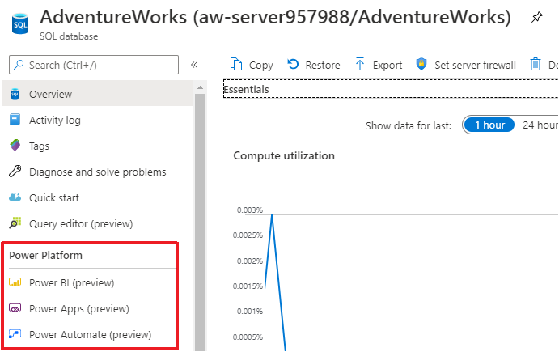
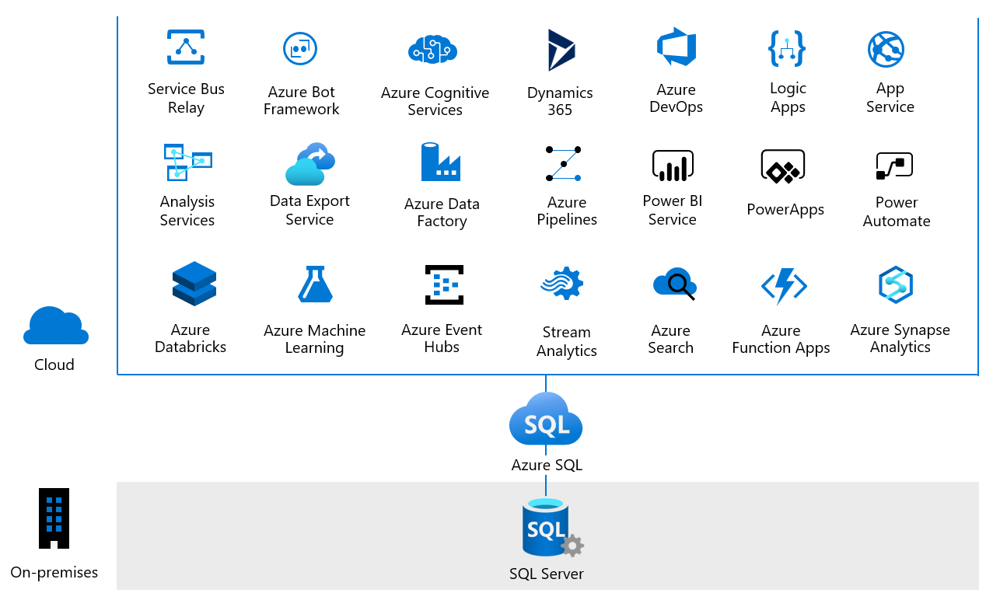

# The Azure SQL Workshop

#### <i>A Microsoft workshop from the SQL team</i>

 <h2>06 - Putting it all together</h2>

In this workshop, you have covered deploying and configuring a secure, performant, and highly available solution with Azure SQL. The end of this module contains several helpful references you can use in these exercises and in production.

In the final activity, we'll validate your Azure SQL expertise with a challenging problem-solution exercise.    

This module can be used stand-alone and does not require any prerequisites other than a laptop and a place to take notes (OneNote, Paint, PowerPoint, Visio, etc.). You may also just use a whiteboard or paper for your designs. 

There are many elements in a single solution, and in this module you'll learn how to take the business scenario and determine the best resources and processes to use to satisfy the requirements while considering the constraints within the scenario. 

In production, there are normally 6 phases to create  a solution. These can be done in-person, or through recorded documents: 

 - 01 **Discovery**: The original statement of the problem from the customer 
 - 02 **Envisioning**: A "blue-sky" description of what success in the project would look like. Often phrased as *"I can..."* statements
 - 03 **Architecture Design Session**: An initial layout of the technology options and choices for a preliminary solution
 - 04 **Proof-Of-Concept** (POC): After the optimal solution technologies and processes are selected, a POC is set up with a small representative example of what a solution might look like, as much as possible. If available, a currently-running solution in a parallel example can be used
 - 05 **Implementation**: Implementing a phased-in rollout of the completed solution based on findings from the previous phases
 - 06 **Handoff**: A post-mortem on the project with a discussion of future enhancements
 
Throughout this module, if you want to leverage various project templates you can find them [here](https://github.com/microsoft/sqlworkshops/tree/master/ProjectResources), and the latest icons can be found [here](https://www.microsoft.com/en-us/download/confirmation.aspx?id=41937). These assets can also be used in your production workloads.  

For this module, you'll spend some time determining the problem statement (**Discovery**), but the big focus will be on the **Architecture Design Session**. If you wish to develop your solution further after the course, you can use the assets above to complete all phases.

This module is slightly different than the other modules in that you will work in groups to work through a problem, and then present your findings. If you are completing this workshop in a self-study fashion, you can still work through the problems as a learning exercise.  

This module will be broken up into several sections:  
[6.1](#6.1): Select a scenario  
[6.2](#6.2): Architecture Design  
[6.3](#6.3): What else should I know?  
[6.4](#6.4): Cloud opportunities  
[6.5](#6.5): Workshop closing  

<h2><a name="6.1">6.1 Select a scenario</h2></a>

In this section, you will review two business scenarios and pick one to focus on for the rest of this module. The company descriptions, project goals, and constraints have already been laid out for you.  

Once you've picked a scenario, the first step is to fully understand the problem the company needs to solve, and any requirements and constraints they have on those goals. This is often in the form of a *Problem Statement*, which is a formal set of paragraphs clearly defining the circumstances, present condition, and desired outcomes for a solution. At this point you want to avoid exploring how to solve the problem and focus on what you want to solve. 

After everyone agrees on the problem statement, pull out as many requirements (*goals*) for the project as you can find, and then lay in any constraints the solution has. At this point, it's acceptable to have unrealistic constraints - later you can pull those back after showing a cost/benefit ratio on each requirement and constraint.  

**Scenario 1: Global CDN system**   

*Scenario description*:  

Your customer is a provider for services and content delivery across the globe. They've requested your assistance in architecting a system that can handle thousands of writes per second to what is essentially an operational data mart. They also need to be able to perform real-time analytics on the data, to determine trends and identify anomalies, which they are currently doing with CLR applications. They are not looking for a data warehouse and utilize large portions of the SQL surface area, but they need to be able to scale where their users live.  

Additionally, they are trying to determine which authentication methods they should use in their hybrid environment. While the main solution and application will live in Azure, there is also an application on a non-Azure machine that is domain-joined, a legacy application (they can't change the driver or connection string) on a non-Azure machine, and multiple users that run reports from SQL admin tools (SSMS, ADS, PowerShell) on non-Azure machines that are not domain-joined. Wherever possible, they want to eliminate hardcoding passwords/secrets in the connection strings and app config files, and they want to eliminate using passwords in SQL tools in SQL tools or find a way to enhance that authentication.        

*Scenario guidance*:
* Start with the Azure SQL deployment option that is most compatible with their current solution and available today.
* How will they scale over multiple regions with multiple queries happening at the same time, while isolating read workloads from write workloads? 
* How can they access data across the various deployments?
* Which authentication methods would you recommend for the interaction paths described in the scenario?  

**Scenario 2: Mission critical app**  

*Scenario description*:  

You are hired to architect a mission critical cloud application that requires 99.995% availability because downtime might be life threatening. 911 dispatch, stolen credit card notifications or corporate security reporting are examples of such applications. High performance is required as any delay in response carries high risk. Given the sensitivity of the collected information, data sovereignty must be guaranteed. Your main mission is to ensure that the app is designed and deployed with the appropriate data redundancy and fault resilience to meet the availability and data sovereignty goals.   

Additionally, mission critical cloud applications, especially those mentioned above, are concerned about protecting sensitive data while allowing DBAs to perform their jobs. In this scenario, DBAs must not be able to see sensitive data stored in specific columns and all access to tables containing sensitive data must be monitored. At the same time, DBAs need to be able to troubleshoot performance using the Azure portal and SSMS/ADS and to create new contained database users who must be mapped to Azure AD principals.  
        

*Scenario guidance*:
* Start by selecting the Azure SQL deployment option, service tier and configuration that creates the highest availability.  
* Consider geo-redundancy.  
* What role does co-location play in your solution?  
* Determine a security strategy for meeting the data sensitivity requirements.

<b>Tasks</b>

1. Read each of the scenarios.   
1. Among your group, select one scenario to focus on.    
1. Come up with a problem statement. Usually, these are represented by a one-pager, but for this exercise, it can be informal and brief (1-2 sentences is fine).   
1. Pull out as many requirements for the project as you can find.      
1. Supplement your problem statement with any additional info that is required. Are there sub-goals that you want to add? Any other constraints you can think of?  
> Feel free to adapt the scenario to have more information where you want clarity - you can make assumptions about any part of the scenario.  

<h2><a name="6.2">6.2 Architecture Design</h2></a>

With a firm understanding of what the customer needs, you can now consider the technologies and processes at your disposal for the solution. Each technology will have benefits and considerations, so you first want to identify all your options that will address each of the project's goals.  

After you've identified the options, you can start to think about how you would design a solution. Using a decision matrix can often be helpful when narrowing the options, and you can find more information about how to create one [in an explanation from this workshop](https://aka.ms/w2uwdecisionmatrix) and refer to the article at the bottom of this page.  

After you have a preliminary solution in mind, the next step is often to present it to the larger team (or customer, leadership, etc. depending on the scenario). You'll need to assemble and present your solution in a way that shares the project goals and constraints, as well as how your solution addresses those items.  

<b>Tasks</b>

1. List out the possible technologies and processes that could potentially be used in a solution.  
>Hint: For the security challenges, you might consider leveraging the Azure SQL Security Best Practices Playbook that's available in the [documentation](https://docs.microsoft.com/en-us/azure/sql-database/sql-database-security-best-practice).  
2. Using a decision matrix or some other decision process, select technologies and processes that will make up your preliminary solution. 
1. Create a presentation (can use PowerPoint, a whiteboard, or a document) that presents your project goals and constraints, as well as the recommended solution designs.   

<h2><a name="6.4">6.3 What else should I know?</h2></a>

Over the course of the learning path, you've learn a lot about Azure SQL with regards to security, performance, and availability. There are a few things that didn't quite fit in a particular module, but that you should be aware of as you start developing in Azure SQL.

### Job Management

SQL Server Agent provides a scheduling system for SQL Server users. You can achieve equivalent functionality in Azure SQL through the following:

#### SQL Agent in Managed Instance

SQL Agent is a fully supported service with Azure SQL Managed Instance. SQL Agent jobs are supported only for T-SQL and SSIS job steps. Command shell steps are not supported. Although alerts are not supported, email notifications are supported through Database mail.

#### Elastic Jobs for Azure SQL Database

Azure SQL Database does not support SQL Server Agent. However, you can use the Elastic Job agent Azure service to create and schedule jobs. Jobs are T-SQL scripts that you can run against many database including parallel execution.

#### Azure Automation

Azure automation is a service that allows you to orchestrate processes through a concept called a runbook. A runbook can be composed of code like Powershell or Python and can be directed to any Azure resource.

### Other SQL Server capabilities

There are other capabilities you should know about when comparing SQL Server to Azure SQL:

- **External tables** are allowed across Azure SQL Databases and Azure Synapse Serverless SQL pools.
- **Linked Servers** in Managed Instance to Azure SQL, SQL Server, or Azure Synapse SQL pools.
- **Cross-database queries** are available in Managed Instance.
- **Database Mail** and **Service Broker** are available in Managed Instance.
- **Full-text search** is supported but also take a look at Azure Search integration.
- **Machine Learning Services** is in Preview for Managed Instance.
- **DTC** for Managed Instance is in Preview.
- **xp_cmdshell** is not supported for Azure SQL.

### Errors

Error handling for Azure SQL is very much like SQL Server except for a few key considerations:

#### New errors unique to Azure

There are errors unique to Azure SQL your application needs to be prepared to handle. For example, when you run out of storage or workers in Azure SQL Database you may encounter a different error than you would in SQL Server. 

In some cases, applications may encounter an error when executing a query or connecting indicating a Managed Instance or Database is unavailable. Therefore, ensuring your application has proper retry logic is important for Azure SQL.

Consult the documentation for how to troubleshoot and develop applications for specific errors and transient failures in Azure SQL.

#### Fatal errors that trigger dumps handled by the platform

In some cases, SQL Server will generate a stack dump due to a fatal exception or error. For SQL Server, this could result in users having to work with technical support to obtain a fix and handle the problem. For Azure SQL, any stack dumps are handled by the platform and a failover is initiated if necessary. Furthermore, the Azure SQL engineering team monitors these types of issues and can quickly address them with fixes without the user having to worry about them. This is a great example of why Azure SQL is versionless.

<h2><a name="6.4">6.4 Cloud opportunities </h2></a>

Once a given workload or application is up and running with Azure SQL, and you've configured according to what you've learned in the learning path, you may be wondering what other things you can take advantage of in Azure.

Fortunately, Azure SQL is not the 'end' of your Azure journey. There are many other Azure services that can connect to Azure SQL to help you build more performant and intelligent applications.

If you look at an Azure SQL Database, for example, in the Azure portal, you can see that there are other services that are already integrated with Azure SQL. One example of such integrations is the Power Platform.

Azure SQL Database integration with the Power Platform is going to make it easier for you to connect to SQL data with Power BI (for example, with DirectQuery). It's also going to make it easier for you to easily build applications with little or no code leveraging Power Apps and deploying for use on any device. Finally, Power Automate is going to help you get more out of Azure by enabling you to create automated workflows in minutes across apps and services, such as alerting, Dynamics 365, OneDrive, Office 365, SharePoint, and more.

The Power Platform is just one example of how you can go further from Azure SQL. There are also integrations and connectors around Azure Search (this includes Azure Cognitive Search) and Azure Stream Analytics. Even for services where there aren't specific integrations, all the Azure services are built on the Azure backbone (largely Azure Service Fabric) and can be configured to talk to each other efficiently.

And for your workloads that remain on-premises, there are many technologies and strategies for making the communication with, for example, SQL Server on-premises, fast and effective. You learned about some of those networking options in the security module, but there are more things you can do to make it not only more secure, but also faster and with lower latency. Technologies like ExpressRoute, which gives you a direct line to Azure, can enable you to be successful wherever you are in your Azure journey.

<h2><a name="6.5">6.5 Workshop closing</h2></a>

Congratulations, you have completed the final module in the Azure SQL Workshop. You've taken your SQL Server expertise, and, with some dedication, worked through translating those skills to Azure SQL. Hopefully, your eyes are also opened to the possibilities and benefits associated with moving to Azure SQL and the broader Azure Ecosystem.

### Learn more

As always, there are a few ways you can continue your learning:

- Follow along with the accompanying video series, [Azure SQL for beginners](https://aka.ms/azuresql4beginners)
- Access free sandbox environments for similar labs in the [Azure SQL fundamentals](https://aka.ms/azuresqlfundamentals) learning path on Microsoft Learn
- Build more with an [Azure free trial account](https://aka.ms/c9-azurefree/?WT.mc_id=dataexposed-c9-niner)
- Connect with the Azure SQL and SQL Server product group to learn about the latest innovations on their show, [Data Exposed](https://aka.ms/dataexposedyt), and on Twitter, [@AzureSQL](https://twitter.com/AzureSQL)

#### Building solutions with Azure SQL

In this module, you considered several business scenarios and how to architect a solution. Below are some resources that may be useful as you go through the process with your workloads.

- [How to Write a Problem Statement - Article on writing effective problem statements](http://www.ceptara.com/blog/how-to-write-problem-statement)
- [Decision Matrix Analysis - Article on creating a Decision Matrix](https://www.mindtools.com/pages/article/newTED_03.htm)
- [Azure Pricing Calculator - Create a cost analysis of your solution](https://azure.microsoft.com/pricing/calculator/)
- [Azure Data Architecture Guide - This guide presents a structured approach for designing data-centric solutions on Microsoft Azure. It is based on proven practices derived from customer engagements](https://docs.microsoft.com/azure/architecture/data-guide/)
- [Azure Reference Architectures - Recommended practices, along with considerations for scalability, availability, manageability, and security](https://docs.microsoft.com/azure/architecture/reference-architectures/)
- [Microsoft Cloud Adoption Framework for Azure](https://docs.microsoft.com/azure/architecture/cloud-adoption/)
- [Microsoft Azure Trust Center - Full reference site for Azure security, privacy and compliance](https://azure.microsoft.com/overview/trusted-cloud/)
- [Azure SQL Security Playbook - Best practices for securing your Azure SQL deployment](https://docs.microsoft.com/azure/sql-database/sql-database-security-best-practice)